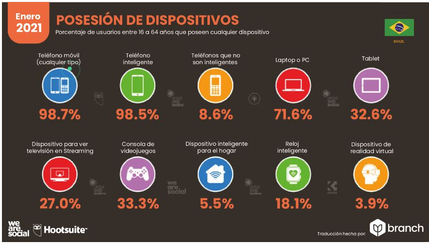
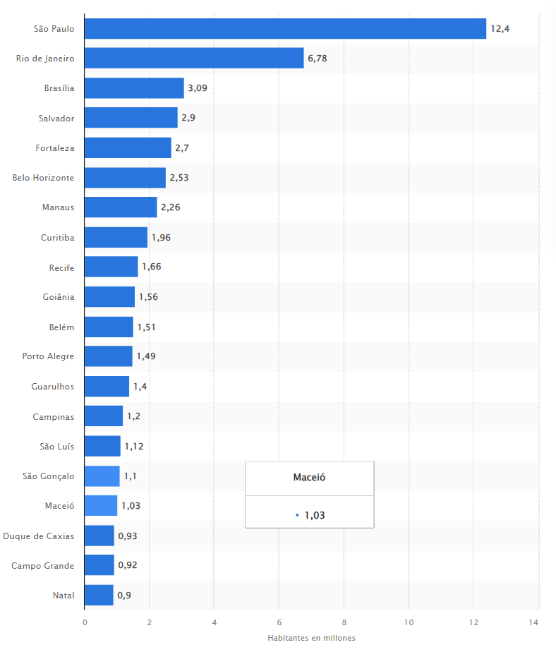
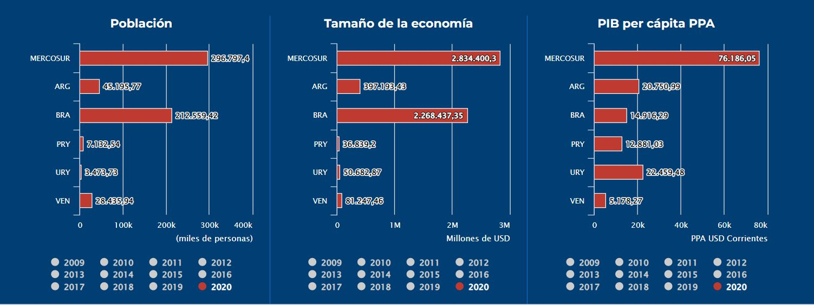
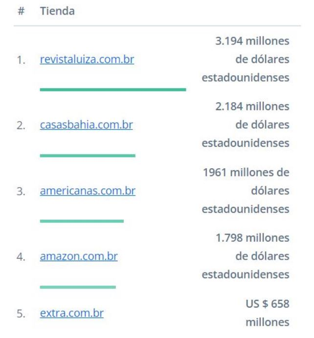

# Analisis descriptivo

# E-commerce ¿Que es?
El e-commerce o comercio electrónico es la práctica de comprar y vender productos a través de internet. También se llama "ecommerce" a cada tienda online que se dedica a este negocio.

El sector del comercio electrónico ha sido uno de los más disruptores de los últimos años, porque ha revolucionado el comercio tradicional ofreciendo un nivel de comodidad y personalización sin precedentes. Por ello, el comercio electrónico se ha convertido en la base del modelo de negocio para muchísimas marcas.

 
## Olist
Ayuda a los vendedores a encontrar a los compradores

## ¿Qué es olist exactamente?

(LAolist as a Service) fundada en 2015 que ofrece una solución para aumentar las ventas para minoristas de todos los tamaños, para la mayoría de los segmentos, ya sea que tengan presencia en línea o no.

La solución de olist se compone de tres frentes: Software, Contratos con los principales marketplaces y compartición de reputación. Estos tres frentes juntos forman el inédito servicio de olist , sin comparación con ningún otro servicio existente en el mundo.

El cliente olist cuenta con las ventajas específicas de cada uno de los frentes, tales como:

- Software: Gestión centralizada de pedidos (pedidos de cualquiera de los distintos marketplaces gestionados en una única plataforma), datos para envío, generación de etiquetas personalizadas, entre otros servicios.

– Contratos exclusivos: olist tiene contratos ya firmados con los principales marketplaces de Brasil, además de un contrato muy ventajoso con Correos. a través de olist -y de un solo contrato- los tenderos pueden empezar a vender en diferentes marketplaces, acortando caminos para aumentar las ventas. No es necesario tener contratos directos con marketplaces. ¡Utilizas nuestro contrato y listo!

– Reputación compartida: como olist también es una gran tienda por departamentos, todas las ventas realizadas en olist dentro de los mercados generan una reputación muy alta que se comparte entre todos los minoristas participantes de olist . Incluso los comerciantes que son nuevos en el mundo de las ventas pueden beneficiarse de espacios privilegiados, campañas y otras facilidades que solo un servicio como olist puede ofrecer.

## ¿Olist es un mercado?

No. El olist es una gran tienda por departamentos dentro de los mercados, pero no es un mercado per se. olist tiene contrato con los principales marketplaces de Brasil y ofrece estos contratos para que otros tenderos puedan empezar a vender sin complicaciones. El olist es el camino más corto entre pensar en vender y empezar a ganar.

## ¿Olist es un integrador?

No. El servicio que ofrece olist es totalmente diferente al servicio de integración de productos con marketplaces. Es un servicio mucho más completo en realidad. olist es una gran tienda cuya fuerza y ​​diferencial radica en la unión de todos los comerciantes participantes, quienes comparten beneficios muy difíciles de obtener cuando se opera solo directamente en los canales de venta.

## ¿Es el olist un intermediario para mis ventas?

No. LA , como tienda por departamentos que cuenta con espacios privilegiados en las principales plazas, hace que sus productos ganen relevancia y visibilidad con la fuerza que generan las ventas de todos los participantes.

Puede pensar en la lista como el canal principal para promocionar sus productos en los mercados. Nuestro propósito es simplificar el proceso y ayudarte a vender cada vez más

Autor. Branch

## Dispositivos que mas utilizan los usuarios de internet

Autor. Branch

## Ciudades con la mayor cantidad de habitantes en Brasil en 2021

Autor. Statista

## Comparacion sistema economico latinoamericano y del caribe 

Autor.SELA

## Reporte Americas Market Intelligence

Brasil no para de mejorar su crecimiento en ventas minoristas. Según los Índices de rendimiento minorista (IPV, por sus siglas en portugués) publicados por HiPartners y la Sociedad Brasileña de Comercio Minorista y Consumo (SBVC), las ventas retail en comercios físicos aumentaron un 22 % durante el primer semestre de 2022, con excelente afluencia en centros de compra. Así mismo, durante el Black Friday de noviembre 2022, las ventas minorsitas aumentaron un 6,9 % respecto a 2021.

El crecimiento es igualmente positivo en el comercio electrónico brasileño. Los grandes retailers de Brasil como Mercado Livre y Amazon tuvieron éxito en ventas durante el Black Friday de noviembre 2022. Para Amazon, el 2022 ha sido “su mejor Black Friday” gracias a la venta de más de 3 millones de productos en Brasil en solo 48 horas. En cuanto a Mercado Livre, este reportó un crecimiento del 10 % en ventas Black Friday durante las primeras 48 horas, y un aumento total “por encima del 30 %” a final de la semana.

## 1 Teatros en casa y proyectores
Según encuestas de la firma Criteo, ha habido un crecimiento exponencial en ventas de algunos electrónicos en Brasil, particularmente teatros en casa y proyectores.Según su análisis de tendencias, las ventas de teatros en casa registraron un aumento interanual de 78 % en octubre de 2022. En junio de 2022, el crecimiento en ventas interanual de teatros en casa en Brasil fue de un sorprendente 283 %. De forma similar, la venta de proyectores tuvo un crecimiento de 104 % interanual en Brasil a octubre de 2022. En abril de ese año, el aumento interanual registrado fue de 161 %.

## 2 Vehículos eléctricos
El mercado de vehículos eléctricos ligeros en Brasil reporta un aumento en ventas del 10,5 % anual entre enero y octubre de 2022, gracias a la venta de 38,7 mil unidades, dice la Asociación Brasileña de Vehículos Eléctricos (ABVE, por sus siglas en portugués).

La ABVE pronostica que el mercado de vehículos eléctricos de Brasil cerrará con un alza de entre 25 % y 31 % en ventas en 2022, con el registro final de entre 44 y 46 mil vehículos eléctricos ligeros. Los vehículos eléctricos de batería (BEV) son los más vendidos en Brasil. Entre enero y octubre de 2022 se vendieron 6,8 mil unidades, lo que representó un aumento en ventas del 41,5 % “sobre el total de vehículos BEV matriculados a nivel histórico entre 2012 y 2021 (4,8 mil)”, según registros de la ABVE.

## 3 Nutrición deportiva
Los productos para la nutrición de atletas y deportistas, entre proteínas en polvo, creatina, suplementos, barras energéticas, entre otros, presentarán un aumento en ventas compuesto anual de 5,8 % entre 2022 y 2030, según Grand View Research. Los productos orientados a la reparación cognitiva tendrán la mayor participación, seguido de los productos energéticos y aquellos para ganar fuerza y resistencia.

## 4 Cosméticos
La venta de cosméticos en Brasil estima un crecimiento anual compuesto (TCAC) de 5 % entre 2022 y 2028, según Report Ocean. Este mercado incluye los productos para el cabello, cuidado de la piel, maquillaje, fragancias y perfumes; productos de higiene y cosméticos orales.

Cabe notar que el segmento de cosméticos, higiene personal y perfumería tuvo un crecimiento en ventas del 10 % durante el primer semestre de 2022, según la Asociación Brasileña de la Industria de Higiene Personal, Perfumería y Cosméticos (ABIHPEC en portugués).

## 5 Motocicletas
Según la Asociación Nacional de la Distribución de Autos en Brasil (FENABRAVE, por sus siglas en portugués), la venta de motocicletas nuevas en Brasil en 2022 aumentará en un 15 % en comparación con 2021. Durante el primer semestre de 2022, FENABRAVE reportó la venta de 637 mil unidades de motocicletas en Brasil respecto a las 517 mil vendidas el año pasado, un aumento superior al 23 %.

## 6 Videojuegos
El mercado de videojuegos en Brasil mostró un crecimiento en ventas superior al 5 % en 2021, con ingresos cercanos a los US$ 2 mil millones, según datos compartidos por PagBrasil. Para 2022, se espera que el mercado de videojuegos en Brasil aumente sus ventas en un 5,3 %. Brasil, por cierto, sigue líderando el mercado de videojuegos en América Latina. Se estima que el 70 % de la población brasileña juega videojuegos, según lo reportado por PagBrasil.

## Principales razones por las que el consumidor brasileño compra en linea:

1.El 73% de los clientes no quiere salir de casa.

2.El 52% prefiere las promociones especiales como envío gratis, descuento, muestras y programa de fidelización.

3.El 47% valora el tiempo ahorrado.

4.El 38% toma en consideración los plazos de entrega de los pedidos.

## Principales tiendas en línea del mercado de comercio electronico en brasil por ventas netas de comercio electronico 2021

Autor. M4rketing Ecomerce

