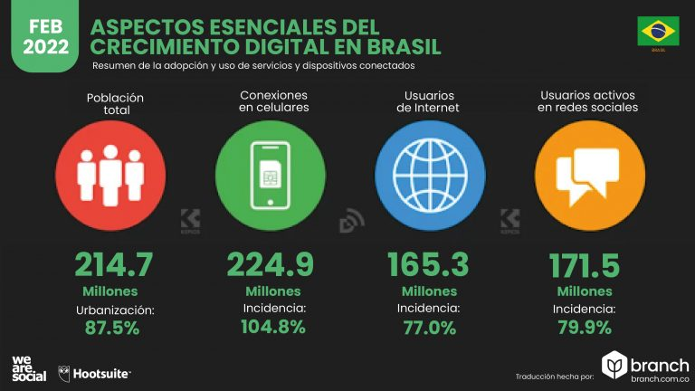

# E-commerce ¿Que es?
El e-commerce o comercio electrónico es la práctica de comprar y vender productos a través de internet. También se llama "ecommerce" a cada tienda online que se dedica a este negocio.

El sector del comercio electrónico ha sido uno de los más disruptores de los últimos años, porque ha revolucionado el comercio tradicional ofreciendo un nivel de comodidad y personalización sin precedentes. Por ello, el comercio electrónico se ha convertido en la base del modelo de negocio para muchísimas marcas.

 
## Olist
Ayuda a los vendedores a encontrar a los compradores

## ¿Qué es olist exactamente?

LAolist as a Service) fundada en 2015 que ofrece una solución para aumentar las ventas para minoristas de todos los tamaños, para la mayoría de los segmentos, ya sea que tengan presencia en línea o no.

La solución de olist se compone de tres frentes: Software, Contratos con los principales marketplaces y compartición de reputación. Estos tres frentes juntos forman el inédito servicio de olist , sin comparación con ningún otro servicio existente en el mundo.

El cliente olist cuenta con las ventajas específicas de cada uno de los frentes, tales como:

- Software: Gestión centralizada de pedidos (pedidos de cualquiera de los distintos marketplaces gestionados en una única plataforma), datos para envío, generación de etiquetas personalizadas, entre otros servicios.

– Contratos exclusivos: olist tiene contratos ya firmados con los principales marketplaces de Brasil, además de un contrato muy ventajoso con Correos. a través de olist -y de un solo contrato- los tenderos pueden empezar a vender en diferentes marketplaces, acortando caminos para aumentar las ventas. No es necesario tener contratos directos con marketplaces. ¡Utilizas nuestro contrato y listo!

– Reputación compartida: como olist también es una gran tienda por departamentos, todas las ventas realizadas en olist dentro de los mercados generan una reputación muy alta que se comparte entre todos los minoristas participantes de olist . Incluso los comerciantes que son nuevos en el mundo de las ventas pueden beneficiarse de espacios privilegiados, campañas y otras facilidades que solo un servicio como olist puede ofrecer.

## ¿Olist es un mercado?

No. El olist es una gran tienda por departamentos dentro de los mercados, pero no es un mercado per se. olist tiene contrato con los principales marketplaces de Brasil y ofrece estos contratos para que otros tenderos puedan empezar a vender sin complicaciones. El olist es el camino más corto entre pensar en vender y empezar a ganar.

## ¿Olist es un integrador?

No. El servicio que ofrece olist es totalmente diferente al servicio de integración de productos con marketplaces. Es un servicio mucho más completo en realidad. olist es una gran tienda cuya fuerza y ​​diferencial radica en la unión de todos los comerciantes participantes, quienes comparten beneficios muy difíciles de obtener cuando se opera solo directamente en los canales de venta.

## ¿Es el olist un intermediario para mis ventas?

No. LA , como tienda por departamentos que cuenta con espacios privilegiados en las principales plazas, hace que sus productos ganen relevancia y visibilidad con la fuerza que generan las ventas de todos los participantes.

Puede pensar en la lista como el canal principal para promocionar sus productos en los mercados. Nuestro propósito es simplificar el proceso y ayudarte a vender cada vez más

## Ciudades con la mayor cantidad de habitantes en Brasil en 2021

## Comparacion sistema economico latinoamericano y del caribe SELLA

